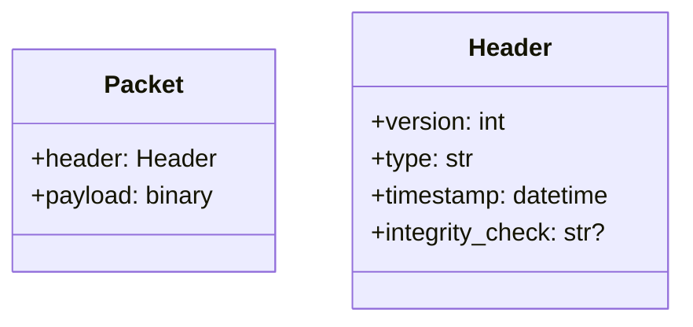
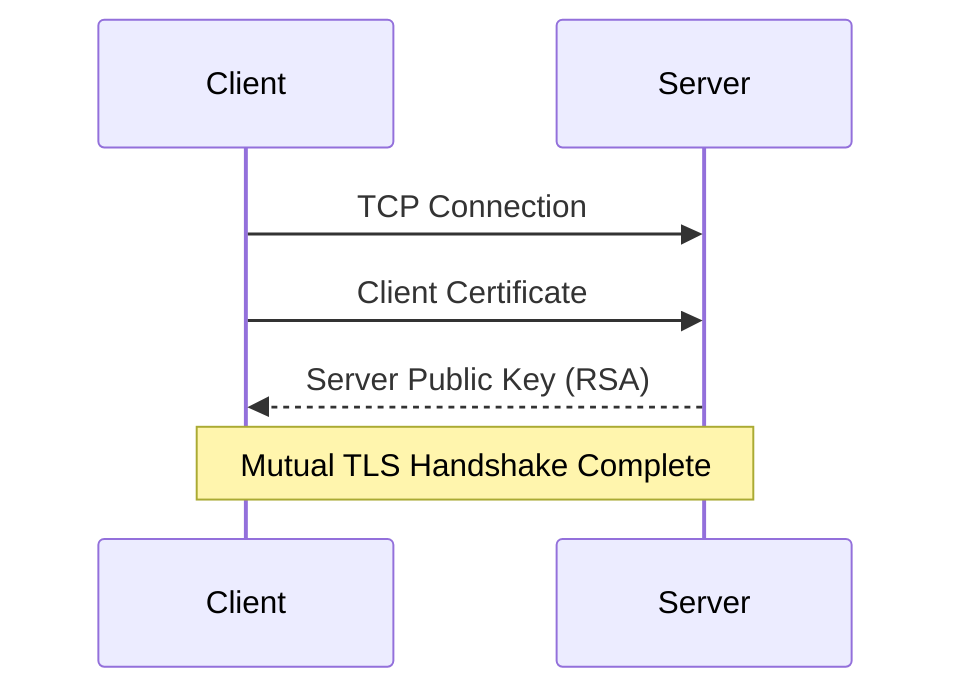
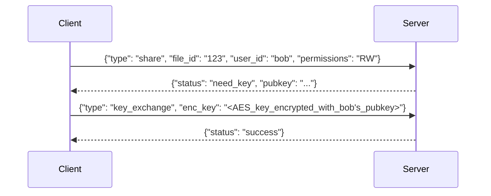
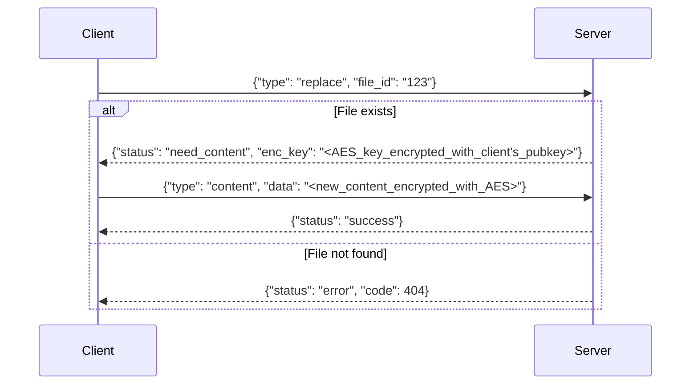
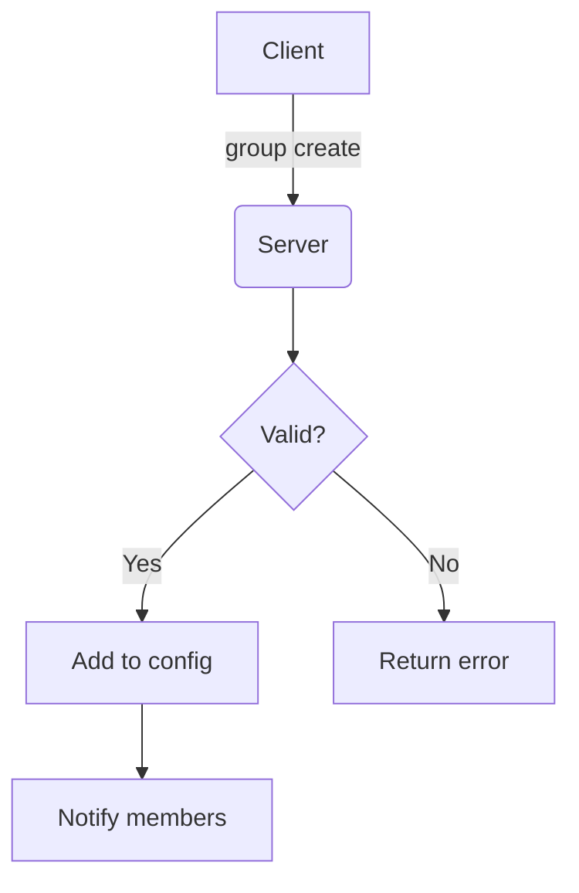
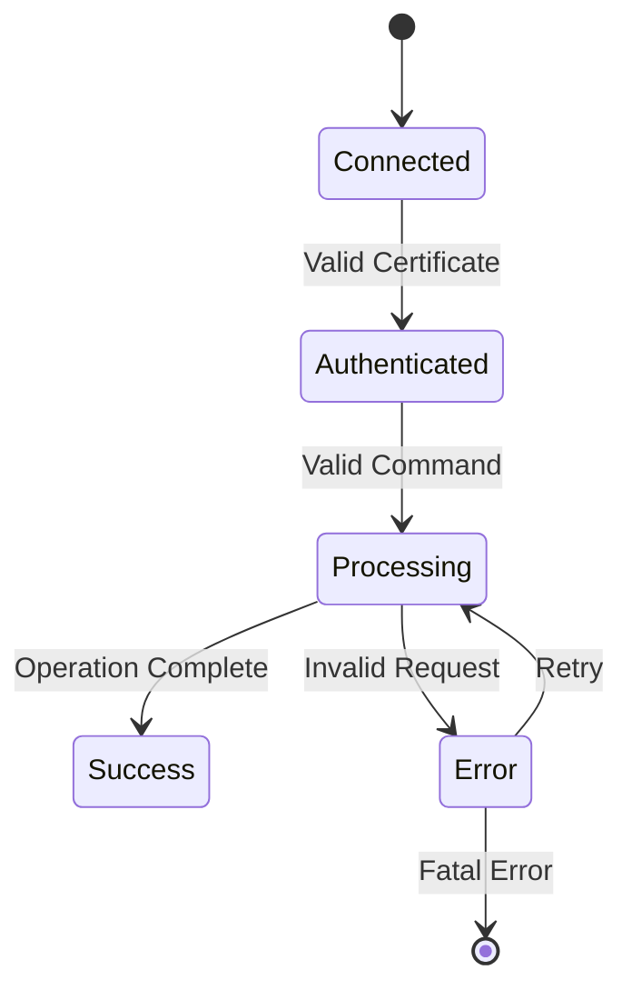
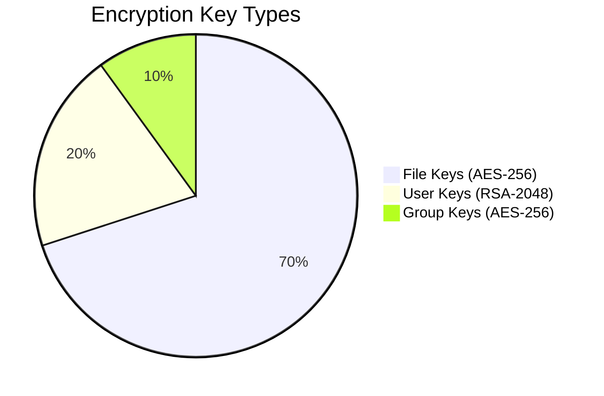

# Secure Vault Communication Protocol

## Packet Structure


## Authentication Flow


## File Sharing (`share` command)


## File Replacement (`replace` command)


## Group Management


## Error Handling States


## Key Exchange Details


## Implementation Notes
1. **BSON Schema**:
```python
{
    "header": {
        "version": 1,
        "type": "command_name",
        "timestamp": "ISO8601"
    },
    "payload": "binary_encrypted_data"
}
```

2. **Status Codes**:
- `200`: Success
- `400`: Invalid request
- `403`: Permission denied
- `404`: Not found
- `500`: Server error
